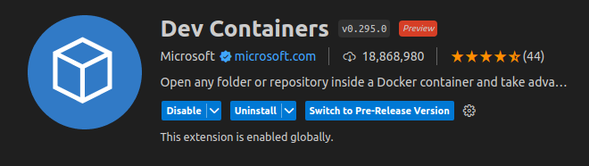
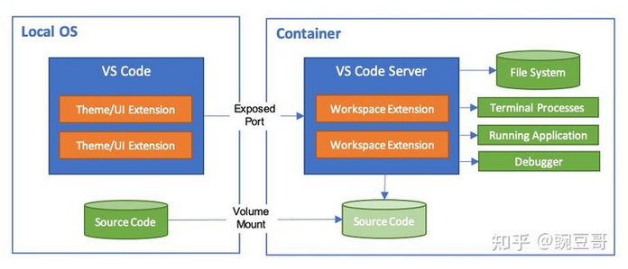
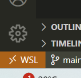
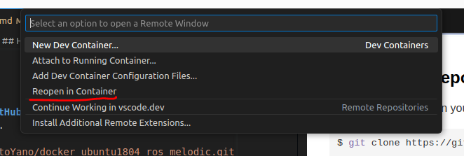
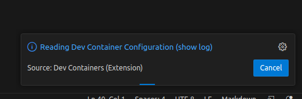
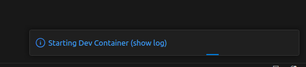
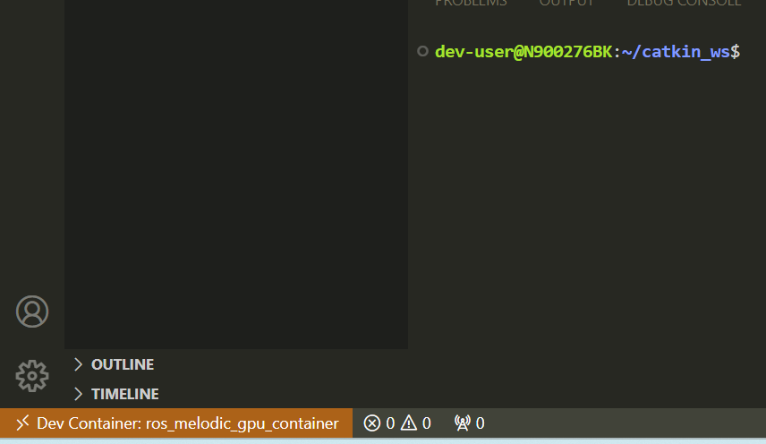
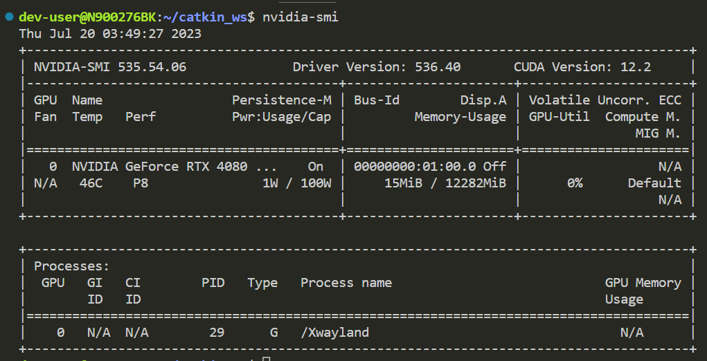
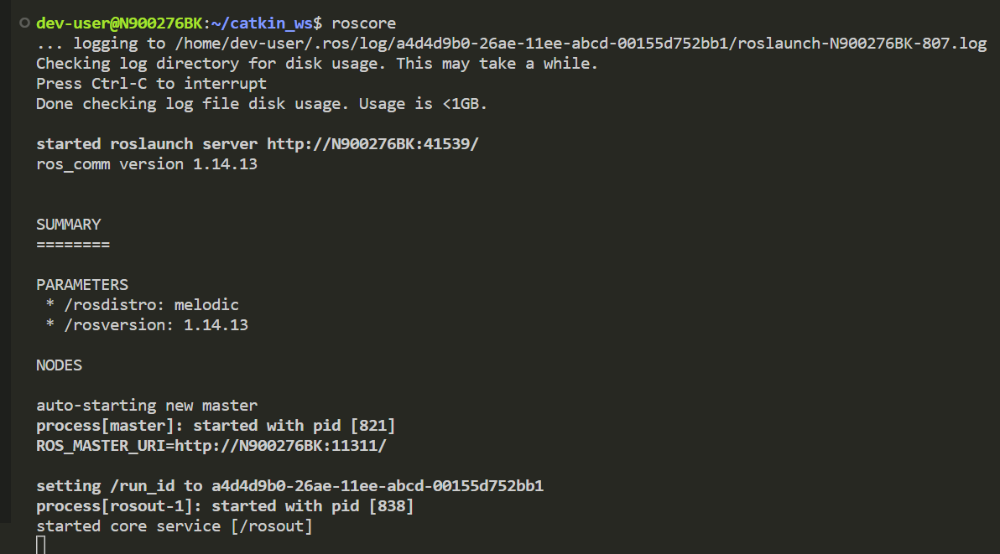
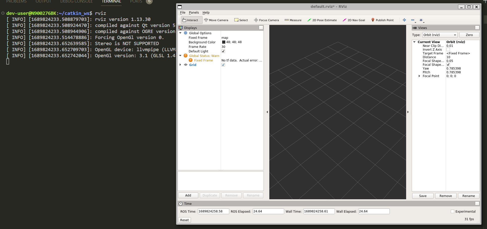

# docker_ubuntu1804_gpu_ros_melodic
Dockerfile to build docker image of Ubuntu 18.04 which recognizes GPU and ROS Melodic is installed.

## What is this?
You can build and run a docker image/container of Ubuntu 18.04 which has ROS Melodic. In the container, GPU can be used and GUI applications like rviz can be displayed. I hope this repository will make your ROS environment setting up more efficient.  

## Supported platforms
Currently, only WSL2 on Windows11 is supported.  

## Requirements
### OS
To install Docker Engine, you need the 64-bit version of Ubuntu as follow.  

* Ubuntu Lunar 23.04
* Ubuntu Kinetic 22.10
* Ubuntu Jammy 22.04 (LTS)
* Ubuntu Focal 20.04 (LTS)

### Applications
The following applications need to be installed in advance.  

* [Visual Studio Code](https://code.visualstudio.com/)
* [Docker](https://docs.docker.com/engine/install/ubuntu/)
* [NVIDIA Driver](https://www.nvidia.co.jp/Download/index.aspx?lang=jp)
* [nvidia-container-runtime](https://github.com/NVIDIA/nvidia-container-runtime)

## How to use
### 1. Install VSCode's extension for Docker
This extension is used to build a docker image, run a docker container and operate something in the container. Please find "Dev Containers" extension and install on your VSCode.  
  
  

### 2. Clone this repository from GitHub
Clone this repository on your WSL  
```bash
$ git clone https://github.com/ShisatoYano/docker_ubuntu1804_gpu_ros_melodic.git
```

### 3. Open this repo's directory by Dev Containers
After cloned this repository, open the directory from VSCode on your WSL. And then, you can see the following icon at the bottom of left on VSCode's GUI.  
  

Push this icon and the following menue will be opened at the top of VSCode's GUI. And then, select "Reopen in Container".  
  

### 4. Build image and run container
After selected "Reopen in Container", building image and running container starts. Firstly, the following status message is shown on VSCode.  
  

Secondly, the status message is changed as follow.  
  

Finally, the docker container starts running as follow.  
User name is set as "dev-user" in the container and the name is "ros_melodic_gpu_container".  
  

### 5. Confirm container's behavior
After the container started running, execute the following command to confirm that GPU can be recognized in the container.  
```bash
$ nvidia-smi
```
If you could see the following GPU's information on terminal, it would be OK.  
  

Secondly, execute the following command to confirm roscore can be launched.  
```bash
$ roscore
```
If you could confirm roscore was launched, it would be OK.  
  

Finally, confirm rviz can be opened as follow. If you could see rviz opened, everything would be OK.  
  

